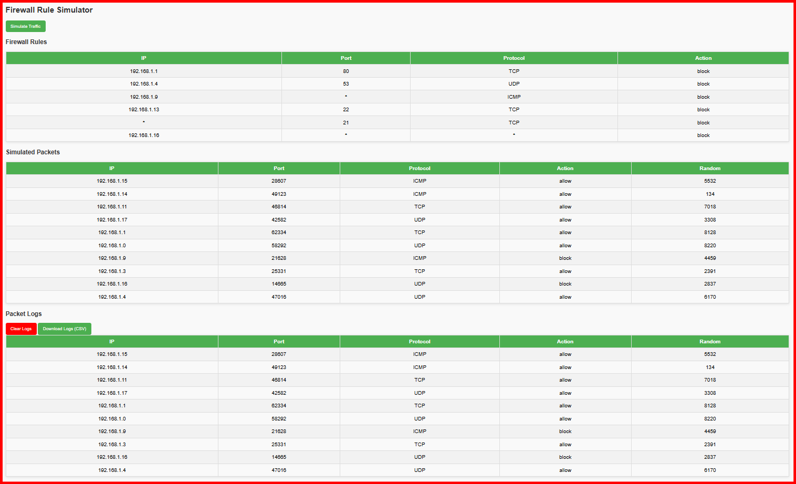

# Firewall Rule Simulator  

🛡️ *Test, simulate, and manage firewall rules in a secure and interactive way.*  

---

## 📌 Overview  
The **Firewall Rule Simulator** is a Python + Flask based project that demonstrates how firewall rules are applied to network traffic.  
It allows users to:  
- Add and manage firewall rules (IP, Port, Protocol, Action).  
- Simulate random traffic packets against the defined rules.  
- View results in a clean, interactive web interface.  

This project is a **Computer Networks mini-project** designed for learning purposes and to showcase practical firewall concepts.  

---
## 🖼️ Screenshot



## ✨ Features  
- ✅ **Add Firewall Rules** – Block or allow traffic based on IP, port, and protocol.  
- ✅ **Delete Rules** – Manage your rule set dynamically.  
- ✅ **Simulate Packets** – Generate random traffic and check if it’s allowed or blocked.  
- ✅ **Web Interface** – Simple, user-friendly UI built with Flask & HTML.  
- ✅ **Realistic Output** – Visualize how firewalls make filtering decisions.  

---

## 🛠️ Tech Stack  
- **Frontend:** HTML, CSS (templates with Jinja2)  
- **Backend:** Python (Flask)  
- **Environment:** Virtual Environment (`venv`)  
- **Version Control:** Git & GitHub  

---

## 🚀 Getting Started  

### 1️⃣ Clone the repository  
```bash
git clone https://github.com/riddhima806/Firewall-Rule-Simulator.git
cd Firewall-Rule-Simulator


